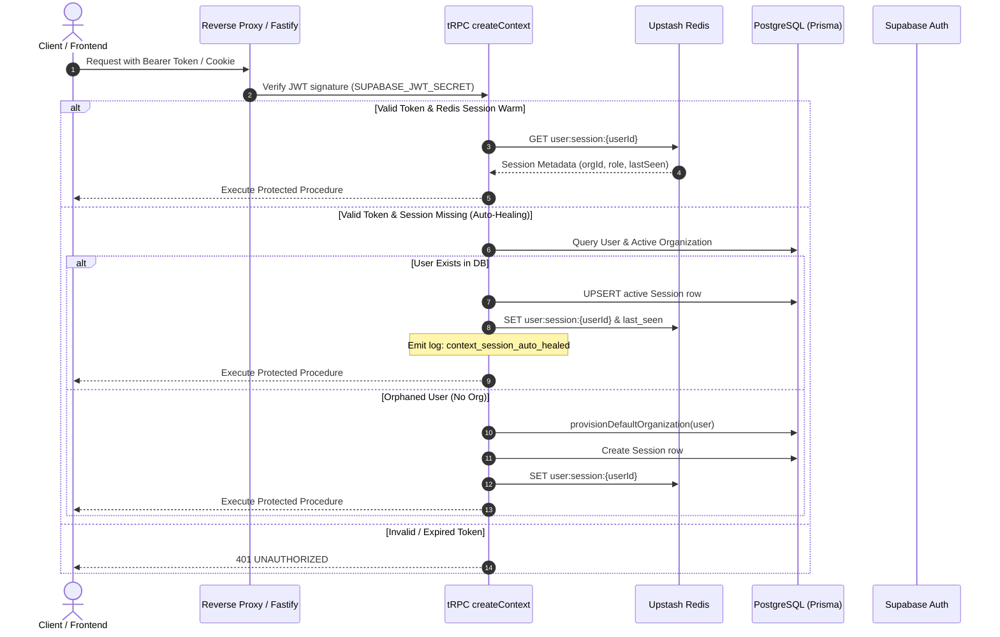

# SheriaBot Fintech Regulatory Backend

Fastify + tRPC v11 + Prisma ORM backend powering SheriaBot's pan-African AI regulatory compliance platform.

---

## 1. Setup & Environment Configuration

### Prerequisites
- Node.js >= 20.x
- PostgreSQL (Supabase / RDS / Local)
- Redis (Upstash Serverless or Redis 7.x)
- Supabase Project (Auth & Storage)

### Environment Variables
Copy `.env.example` to `.env`:
```bash
cp .env.example .env
```

Key environment variables:
| Variable | Description |
|---|---|
| `DATABASE_URL` | PostgreSQL connection pool URL with SSL mode |
| `DIRECT_URL` | Direct connection URL for migrations |
| `UPSTASH_REDIS_REST_URL` | Upstash Redis REST endpoint |
| `UPSTASH_REDIS_REST_TOKEN` | Upstash Redis REST access token |
| `SUPABASE_URL` | Supabase API URL |
| `SUPABASE_SERVICE_ROLE_KEY` | Supabase admin service key |
| `SUPABASE_JWT_SECRET` | Secret used to verify Supabase Auth JWTs |
| `AUTO_CREATE_SESSION_ON_VALID_TOKEN` | Enables automatic session healing when valid JWTs arrive without active Redis/DB sessions |
| `SESSION_FINGERPRINT_MODE` | Session fingerprinting mode (`disabled`, `monitor`, `enforce`) |

---

## 2. Operational & Data Seeding Commands

### Database Migrations & Validation
```bash
npx prisma validate
npx prisma db push --skip-generate
```

### Seeding Commands
```bash
# Seed SystemConfig table (26 canonical definitions) and sync into Redis cache:
npm run seed:system-config

# Seed baseline Kenyan regulatory frameworks (44 frameworks across tiers):
npm run seed:frameworks

# Seed tenant compliance defaults (Checklists & ChecklistItems) across organizations:
npm run seed:tenant-defaults
```

### Backfill & Rollback Commands
```bash
# Preview backfilling orphaned users with default workspace:
npx tsx scripts/backfill-orphaned-organizations.ts --dry-run

# Execute atomic multi-tenancy backfill:
npx tsx scripts/backfill-orphaned-organizations.ts

# Preview rollback of backfilled workspaces:
npx tsx scripts/rollback-backfill-organizations.ts --dry-run

# Execute atomic rollback:
npx tsx scripts/rollback-backfill-organizations.ts
```

### User & Data Purge Protocol
```bash
# Dry-run non-admin purge (preserves myadmin@sheriabot.com, frameworks & SystemConfig):
npx tsx scripts/purge-all-non-admin.ts --dry-run

# Execute confirmed purge:
npx tsx scripts/purge-all-non-admin.ts --confirm
```

---

## 3. Architecture & Authentication Flow

### Auth Flow & Auto-Healing Lifecycle


---

## 4. Testing & Verification

```bash
# Run full backend test suite (207 files, 1,753 tests):
npm run test

# Typecheck:
npm run typecheck

# Build:
npm run build
```
