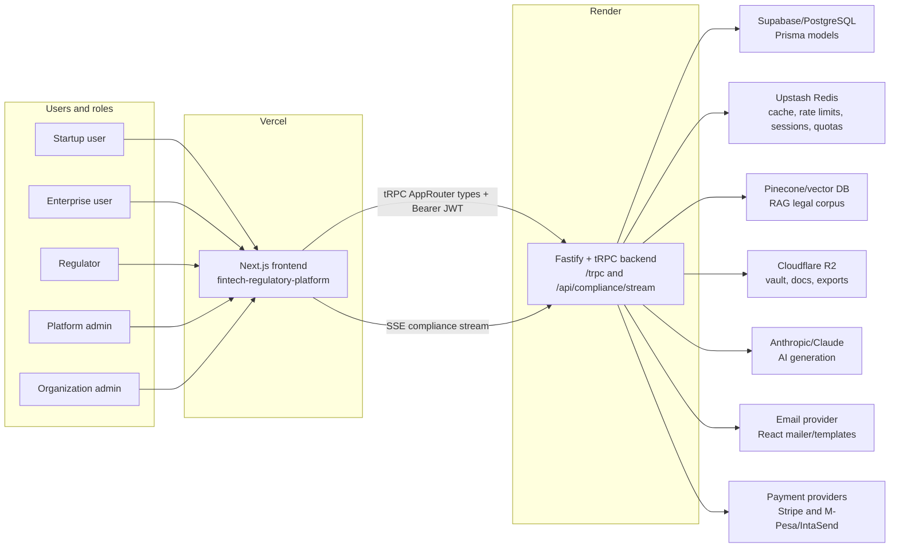
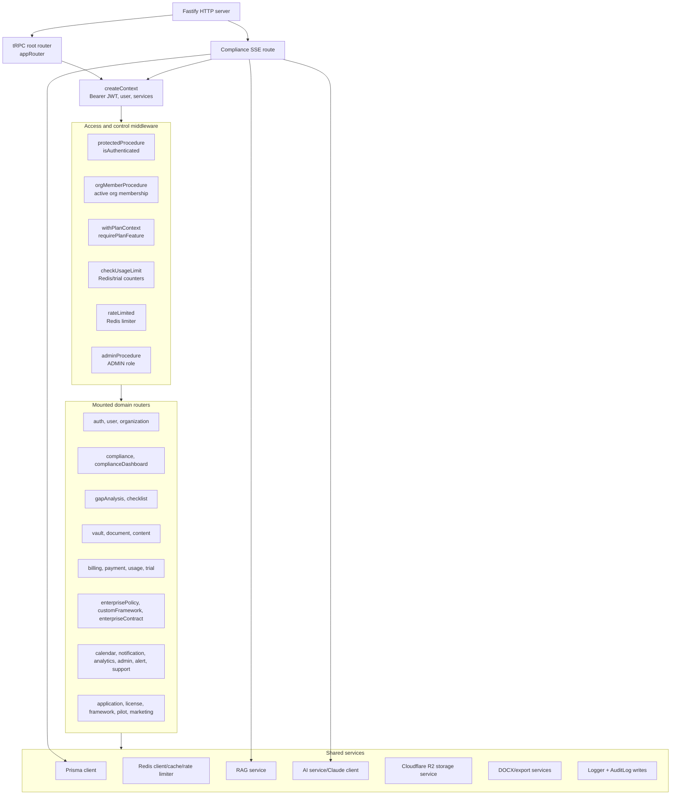
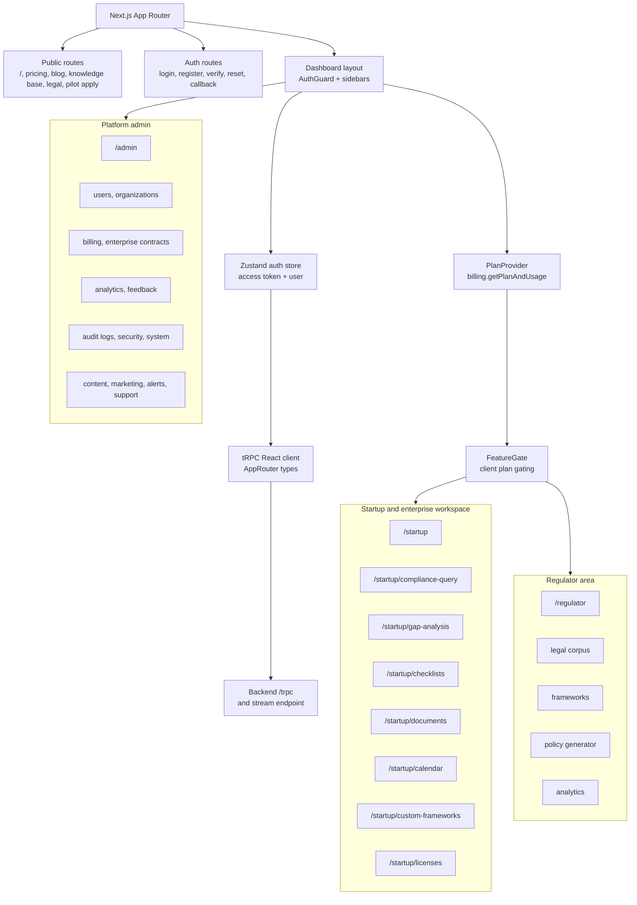
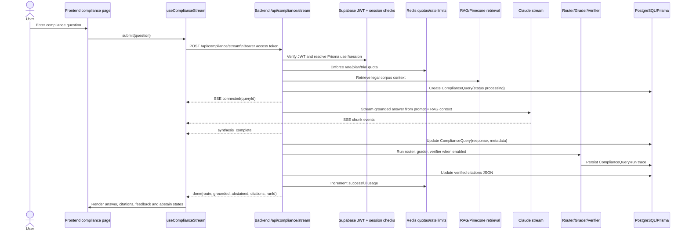
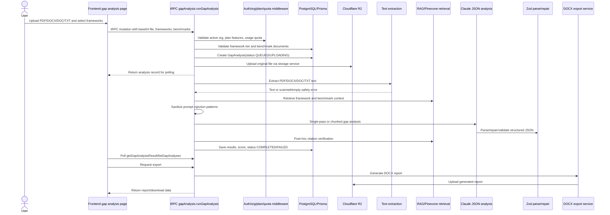
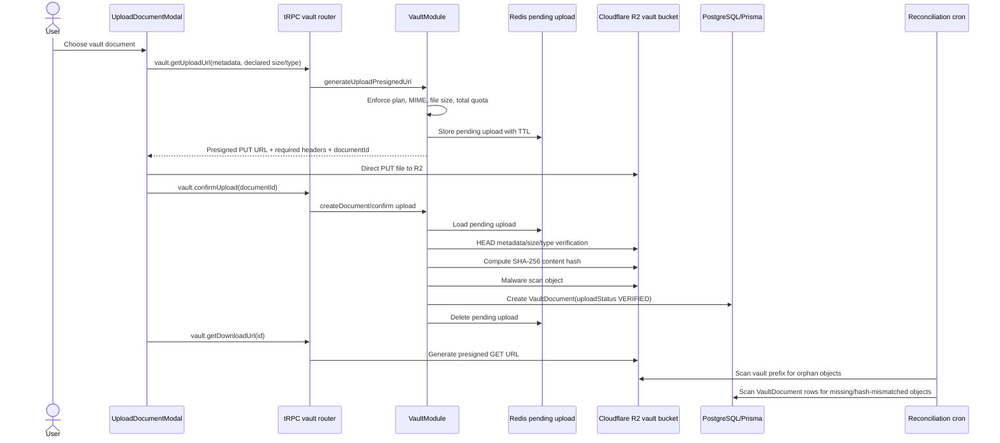
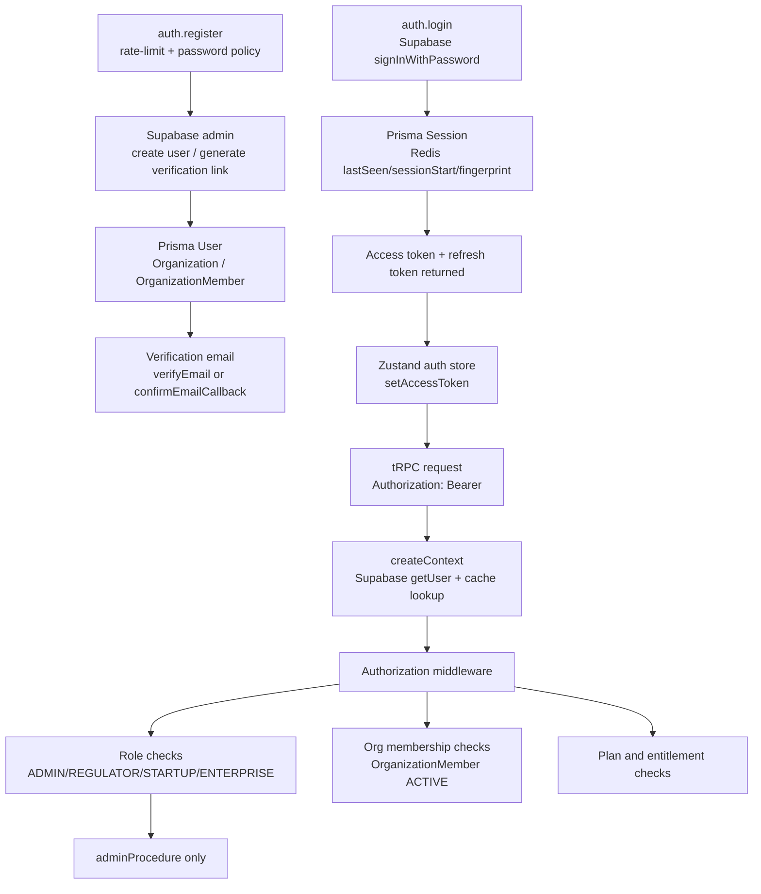
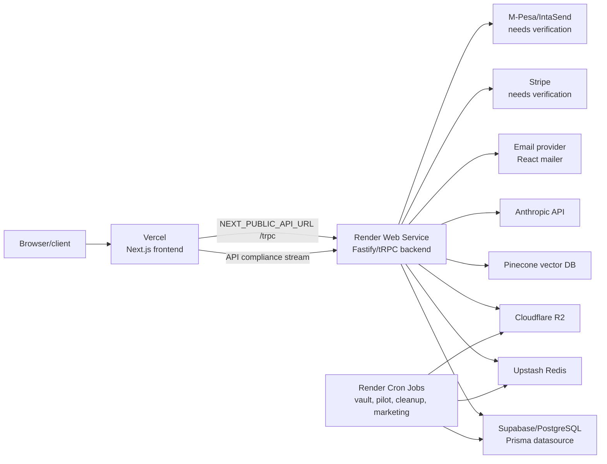

# SheriaBot System Schematics and Flows

## Executive Summary

SheriaBot is a two-repository system: `fintech-regulatory-platform` is the Next.js frontend hosted on Vercel, and `fintech-regulatory-backend` is the Fastify/tRPC TypeScript backend hosted on Render. The backend exposes the root tRPC API at `/trpc` and also registers an SSE endpoint at `/api/compliance/stream` for streaming compliance answers. Authentication is based on Supabase-issued JWT bearer tokens, with Prisma/PostgreSQL as the application database, Upstash Redis for cache/session/rate-limit/usage counters, Pinecone-backed RAG for legal corpus retrieval, Cloudflare R2 for object storage, Anthropic/Claude for AI generation, and email/payment providers wired through backend services.

The diagrams below are based on code evidence only. Items that are configured or referenced but not fully verifiable from the inspected code are marked as needs verification.

## 1. System Context Diagram

Evidence:
- `/trpc` is registered in `fintech-regulatory-backend/src/app.ts` via `fastifyTRPCPlugin` at lines around 390-392.
- `/api/compliance/stream` is registered by `registerComplianceStreamRoute` in `fintech-regulatory-backend/src/app.ts` and implemented in `src/routes/compliance-stream.route.ts`.
- The frontend tRPC client imports `AppRouter` from `@sheriabot/api-types` and sends `Authorization: Bearer ...` in `fintech-regulatory-platform/lib/trpc.ts`.
- Context injects Prisma, Redis, AI, RAG, storage, and mailer services in `fintech-regulatory-backend/src/server/trpc/context.ts`.
- Stripe and M-Pesa/IntaSend are inferred from code fields and routers (`payment.router.ts`, `billing.router.ts`, `PaymentProvider`, organization payment fields); exact production provider configuration needs verification.

## 2. Backend System Schematic

Evidence:
- `appRouter` mounts `auth`, `user`, `organization`, `policy`, `compliance`, `document`, `content`, `admin`, `notification`, `analytics`, `vault`, `billing`, `payment`, `support`, `adminSupport`, `calendar`, `usage`, `trial`, `session`, `pilot`, `checklist`, `complianceDashboard`, `gapAnalysis`, `framework`, `alert`, `adminMarketing`, `publicMarketing`, `enterprisePolicy`, `application`, `license`, `customFramework`, and `enterpriseContract` in `fintech-regulatory-backend/src/server/trpc/router.ts`.
- Middleware is defined in `src/server/trpc/trpc.ts` and `src/server/trpc/middleware.ts`: `protectedProcedure`, `adminProcedure`, `orgMemberProcedure`, `withPlanContext`, `requirePlanFeature`, `checkUsageLimit`, `rateLimited`.
- Shared context services are attached by `createContext` in `src/server/trpc/context.ts`.

## 3. Frontend System Schematic

Evidence:
- Route inventory comes from `fintech-regulatory-platform/app/**/page.tsx`.
- `AuthGuard` redirects unauthenticated users and role-mismatched users in `fintech-regulatory-platform/components/auth-guard.tsx`.
- `PlanProvider` calls `trpc.billing.getPlanAndUsage` and exposes `hasFeature` in `fintech-regulatory-platform/lib/plan-context.tsx`.
- `FeatureGate` renders gated children or locked CTA fallback in `fintech-regulatory-platform/components/plan/feature-gate.tsx`.
- Streaming and tRPC compliance hooks coexist in `fintech-regulatory-platform/hooks/use-compliance.ts`.

## 4. Compliance Query Flow Diagram

Legacy/non-streaming path:
- `trpc.compliance.query` exists in `fintech-regulatory-backend/src/server/routers/compliance.router.ts` and is exposed through `useComplianceQuery` in `fintech-regulatory-platform/hooks/use-compliance.ts`. The current `/startup/compliance-query` page imports and uses `useComplianceStream`, so the SSE route is the active wired path; the tRPC mutation is retained as the non-streaming fallback/legacy path.

Evidence:
- Frontend stream hook: `useComplianceStream` in `fintech-regulatory-platform/hooks/use-compliance.ts`.
- Frontend page wiring: `fintech-regulatory-platform/app/(dashboard)/startup/compliance-query/page.tsx` imports and calls `useComplianceStream`.
- Backend stream route: `registerComplianceStreamRoute` in `fintech-regulatory-backend/src/routes/compliance-stream.route.ts`.
- tRPC fallback mutation: `complianceRouter.query` in `src/server/routers/compliance.router.ts`.
- Orchestrator: `runOrchestrator` in `src/modules/compliance/orchestrator/orchestrator.ts`, with `ComplianceQueryRun` persistence.
- Feedback: `submitFeedback`, `getFeedback`, and saved-response procedures in `src/server/routers/compliance.router.ts`; frontend feedback components live under `fintech-regulatory-platform/components/compliance/`.

## 5. Gap Analysis Flow Diagram

Evidence:
- tRPC entry: `gapAnalysisRouter.runGapAnalysis` in `fintech-regulatory-backend/src/server/routers/gap-analysis.router.ts`.
- Middleware gates: `withPlanContext`, `requirePlanFeature('gapAnalysis')`, `requirePlanFeature('benchmarkDocuments')`, and `checkUsageLimit(BillingMetric.GAP_ANALYSES, { deferIncrement: true })`.
- Pipeline: `ComplianceModule.runGapAnalysis` and `executeGapAnalysisPipeline` in `src/modules/compliance/compliance.module.ts`.
- Extraction: `extractPdfText` and `mammoth.extractRawText` in `executeGapAnalysisPipeline`.
- Safety: empty/scanned document guard and `sanitizePolicyText` from `src/lib/ai/prompts/gap-analysis.ts`.
- Structured validation/repair: `parseGapAnalysisOutput` and retry paths in `src/lib/ai/ai.service.ts`.
- Export: `gapAnalysisExportService.generateGapAnalysisDocx` in `src/services/gap-analysis-export.service.ts`; upload helper `storageService.uploadGapAnalysisExport`.

## 6. Document Vault / Upload Flow

Evidence:
- Frontend direct upload: `UploadDocumentModal` in `fintech-regulatory-platform/components/vault/upload-document-modal.tsx`.
- tRPC router: `fintech-regulatory-backend/src/server/routers/vault.router.ts`.
- Presign, pending state, confirmation, metadata verification, hashing, malware scan, DB write: `VaultModule.generateUploadPresignedUrl`, `storePendingUpload`, `loadPendingUpload`, `verifyVaultObjectBeforeConfirm`, `createDocument` in `src/modules/vault/vault.module.ts`.
- Reconciliation: `runVaultReconciliation` in `src/modules/vault/reconciliation.service.ts` and cron wrapper `src/scripts/vault-reconciliation-cron.ts`.

## 7. Auth and Authorization Flow

Evidence:
- Registration/login/logout/email verification/refresh deprecation: `fintech-regulatory-backend/src/server/routers/auth.router.ts`.
- Token validation and session enforcement: `createContext` in `src/server/trpc/context.ts`.
- Protected/admin/org/role middleware: `src/server/trpc/trpc.ts` and `src/server/trpc/middleware.ts`.
- Frontend token storage and tRPC header injection: `fintech-regulatory-platform/lib/auth-store.ts` and `lib/trpc.ts`.
- Refresh-token endpoint is explicitly deprecated in backend comments; frontend should use Supabase refresh (`auth.router.ts`, `refreshToken` procedure).

## 8. Data Model Relationship Schematic

```mermaid
erDiagram
  User ||--o{ OrganizationMember : has_memberships
  Organization ||--o{ OrganizationMember : has_members
  Organization ||--o{ User : legacy_primary_org
  User ||--o{ Session : has_sessions
  Organization ||--o{ UsageRecord : tracks_usage
  Organization ||--o{ Payment : has_payments
  Organization ||--o{ EnterpriseContract : has_contracts
  EnterpriseContract ||--o{ EnterprisePlanOverride : defines_overrides

  User ||--o{ ComplianceQuery : asks
  ComplianceQuery ||--o{ ComplianceQueryRun : has_traces
  ComplianceQuery ||--o{ QueryFeedback : receives_feedback
  User ||--o{ QueryFeedback : submits_feedback

  User ||--o{ Checklist : generates
  Organization ||--o{ Checklist : owns
  Checklist ||--o{ ChecklistItem : contains

  User ||--o{ GapAnalysis : runs
  GapAnalysis ||--o{ GapAnalysisFramework : snapshots_frameworks
  RegulatoryFramework ||--o{ GapAnalysisFramework : referenced_by

  User ||--o{ VaultDocument : uploads
  Organization ||--o{ VaultDocument : owns

  LegalDocument ||--o{ DocumentChunk : has_chunks
  User ||--o{ LegalDocument : authors

  Organization ||--o{ CustomFramework : owns
  CustomFramework ||--o{ CustomFrameworkSection : has_sections
  CustomFramework ||--o{ CustomFrameworkControl : has_controls
  CustomFramework ||--o{ CustomFrameworkVersion : versions

  User ||--o{ GeneratedPolicy : creates
  Organization ||--o{ GeneratedPolicy : owns
  GapAnalysis ||--o{ GeneratedPolicy : source_for
  GeneratedPolicy ||--o{ GeneratedPolicyCitation : cites
  GeneratedPolicy ||--o{ GeneratedPolicySourceSnapshot : captures_sources
  GeneratedPolicy ||--o{ GeneratedPolicyExportLog : exports
  GeneratedPolicy ||--o{ GeneratedPolicySectionVersion : section_versions
  GeneratedPolicy ||--o{ GeneratedPolicyGenerationEvent : generation_events

  Organization ||--o{ ComplianceEvent : schedules
  ComplianceEvent ||--o{ Notification : notifies
  User ||--o{ Notification : receives
  User ||--o{ AuditLog : actor
```

Evidence:
- Prisma schema models and relations are in `fintech-regulatory-backend/prisma/schema.prisma`.
- Important line anchors: `User` around line 9, `Organization` around 134, `ComplianceQuery` around 419, `ComplianceQueryRun` around 453, `Checklist` around 593, `GapAnalysis` around 657, `QueryFeedback` around 1205, `UsageRecord` around 1343, `CustomFramework` around 1387, `Payment` around 1597, `ComplianceEvent` around 1628, `VaultDocument` around 1789, `RegulatoryFramework` around 1839, `GeneratedPolicy` around 2366, `OrganizationMember` around 2568.
- `Subscription` is not a separate Prisma model in the inspected schema. Subscription state is stored mostly on `Organization` fields (`plan`, `subscriptionStatus`, Stripe IDs, M-Pesa fields), with `Payment`, `UsageRecord`, `EnterpriseContract`, and `EnterprisePlanOverride` supporting billing and entitlement state.
- The user prompt mentions `LegalDocument / DocumentChunk`; the schema also contains `RegulatoryDocument / RegulatoryDocumentChunk` for regulatory corpus content. Both are present; the ER diagram keeps `LegalDocument / DocumentChunk` to match the requested main entities and notes the regulatory corpus models as present.

## 9. Deployment Schematic

Evidence:
- Backend server start uses `PORT` in `fintech-regulatory-backend/src/index.ts`.
- Render proxy assumptions are commented in `fintech-regulatory-backend/src/app.ts` and `src/plugins/security.plugin.ts`.
- Render cron references exist in `src/scripts/vault-reconciliation-cron.ts`, `pilot-lifecycle-cron.ts`, `cleanup-deleted-documents.ts`, `cleanup-compliance-snapshots.ts`, `bulk-send-cron.ts`, and `soft-bounce-cron.ts`.
- Frontend backend URL is `NEXT_PUBLIC_API_URL || http://localhost:4000/trpc` in `fintech-regulatory-platform/lib/trpc.ts`; the stream hook strips `/trpc` to call `/api/compliance/stream`.

## Assumptions / Needs Verification

- Hosting: code comments and request context indicate Vercel for frontend and Render for backend; deployment dashboards were not inspected.
- Pinecone: RAG service file names and behavior indicate vector retrieval, but specific Pinecone environment/index configuration was not inspected in this pass.
- Payment provider specifics: Stripe IDs and M-Pesa/IntaSend fields/procedures are present, but active production provider selection and webhook configuration need environment verification.
- Email provider: React email and mailer services are present, but the concrete provider credentials/configuration need environment verification.
- Frontend production path for compliance query is currently the SSE hook on `/startup/compliance-query`; the older `trpc.compliance.query` hook remains available and should stay behaviorally aligned if retained.
- `Subscription` is not a separate Prisma model; subscription state is embedded on `Organization` and related billing/payment models.

## Key Risks / Fragile Areas

- Compliance query has two live-capable paths: streaming SSE and tRPC mutation. Both need synchronized behavior for citations, quota increments, orchestration, and response shape.
- Plan and quota enforcement exists in middleware, but some frontend gates are only UX gates. The backend remains the source of truth; new procedures must use `withPlanContext`, `requirePlanFeature`, and `checkUsageLimit` consistently.
- Gap analysis returns before the background pipeline completes. Status recovery exists for stale jobs, but failed or partially completed jobs depend on polling and clear user feedback.
- Vault upload security depends on the Redis pending-upload TTL and successful confirmation. Reconciliation mitigates orphaned R2 objects and missing DB rows, but dry-run configuration must be verified before deletion is enabled.
- Organization access has both legacy `requireOrgMember` and newer `requireOrgMembership` middleware patterns. New code should prefer the cached/audited `orgMemberProcedure` path unless a specific legacy route requires otherwise.
- `ComplianceQuery.citations` stores JSON while a `Citation` relation also exists. Comments in the router note a TODO to migrate query citations to the `Citation` table.

## Recommended Next Diagrams

- Detailed entitlement and usage-metering state machine across free trial, pilot, paid plan, grace period, and enterprise overrides.
- RAG ingestion and legal corpus lifecycle diagram, including `RegulatoryDocument`, chunking, embeddings, and authority metadata updates.
- Billing/payment lifecycle diagram for Stripe and M-Pesa/IntaSend, including webhook paths and renewal cron jobs.
- Admin operations map covering audit logs, system config, feature flags, AI jobs, and platform analytics.
- Notification/eventing map showing notification creation, category preferences, email templates, SSE alerts, and background jobs.
